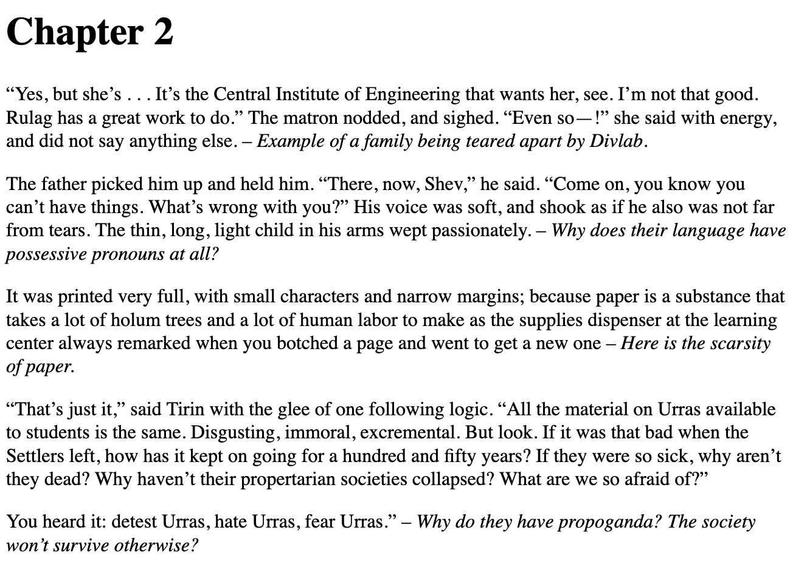

iBooks Highlights Exporter
==========================

Export your highlights from iBooks into an html file with chapter titles. Notes are exported alongside the relevant highlights. Easily create a summary of the books you've read.
You can convert the output to a preferable format using [pandoc](https://pandoc.org/) to refine your summary.

Example
-------

Here is an example of my highlights and notes of _The Dispossessed_:



Requirements
------------
* python3

Usage
------------

Install from `pip`:

```
pip3 install ibooks-highlight-exporter
```

Then simply run after reloading your shell:

```
ibooks_higlight_exporter
```
